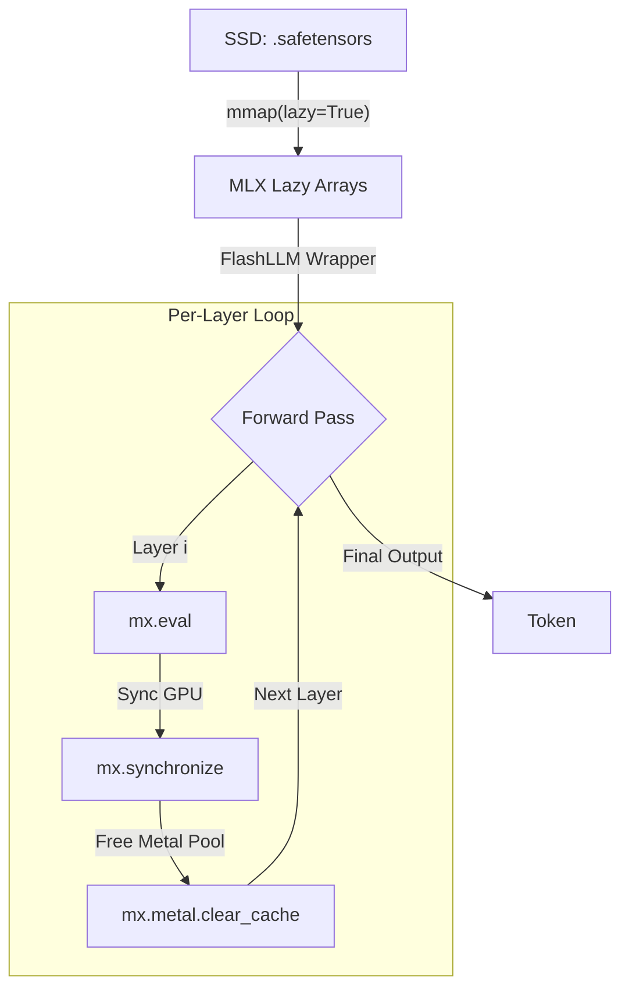
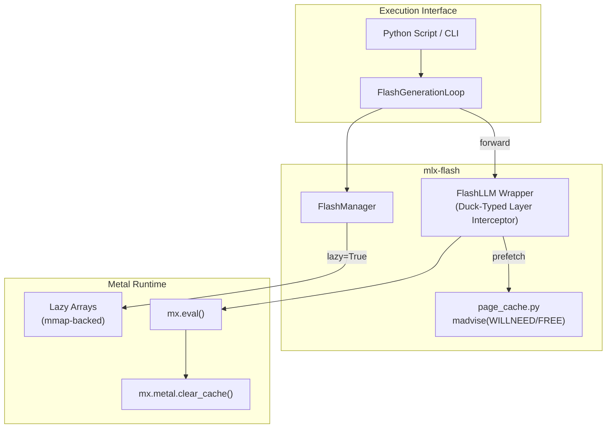
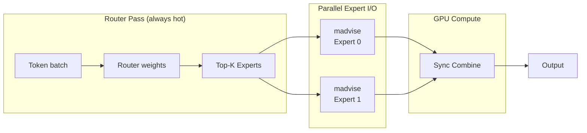

# mlx-flash ⚡

> **Flash Weight Streaming for MLX** — run models larger than your RAM on Apple Silicon.
> 30B on 16 GB, 70B+ on 32 GB+. **No additional quantisation — uses the model's native precision.**

> **Project Lineage:** This implementation is inspired by Apple Research's paper [*LLM in a Flash* (arXiv 2312.11514)](https://arxiv.org/abs/2312.11514), which formalized the concept of using the OS page cache for efficient weight streaming. The original [`flash-moe`](https://github.com/danveloper/flash-moe) project provided the first Objective-C + Metal proof of concept for this approach on Apple Silicon. This repository (`mlx-flash`) extends those principles to the Python-based MLX ecosystem, providing a robust, duck-typed integration layer for `mlx-lm`.

[](LICENSE)
[](https://python.org)
[](https://github.com/ml-explore/mlx)
[](https://apple.com)
[](https://github.com/matt-k-wong/mlx-flash/actions/workflows/tests.yml)

---

## Table of Contents

1. [Why Flash Mode?](#why-flash-mode)
2. [How It Works](#how-it-works)
3. [Architecture Diagrams](#architecture-diagrams)
4. [Performance](#performance)
5. [Output Quality](#output-quality)
6. [Quick Start](#quick-start)
7. [LM Studio Usage](#lm-studio-usage)
8. [Modelfile Usage](#modelfile-usage)
9. [Technical Deep Dive](#technical-deep-dive)
10. [Contributing](#contributing)

---

## Why Flash Mode?

| Model | Hardware | Mode | Load Time | Peak Weight RSS | Result |
|-------|----------|------|-----------|-----------------|--------|
| **Nemotron-30B (17.8 GB)** | 16GB MacBook Air | Normal | 4.1s | 18+ GB (Swap) | ❌ Laggy |
| **Nemotron-30B (17.8 GB)** | 16GB MacBook Air | **Flash** | **0.8s** | **0.6 GB** | ✅ Smooth |

> [!IMPORTANT]
> **Flash Mode is strictly for models that are larger than your RAM.**  
> It allows you to run massive models on base-spec Macs by streaming weights directly from your SSD, keeping your RAM free for activations and context.

The secret: **Synchronous Layer Evaluation**.
Standard MLX uses "lazy graph evaluation," which attempts to build a massive graph spanning all layers before execution. This causes Metal to attempt allocating all weights at once, leading to OOM. 

`mlx-flash` bypasses this by:
1. Loading weights as **lazy mmap-backed arrays** via `mlx_lm.load(path, lazy=True)`.
2. Intercepting the forward pass to execute **one layer at a time**.
3. Forcing materialization via **`mx.eval()` + `mx.synchronize()`** after each layer.
4. Calling **`mx.metal.clear_cache()`** between layers to immediately release weight buffers.

---

## How It Works



### The Mechanism
1. **Lazy Loading**: `mlx_lm.load(path, lazy=True)` maps the entire model into the unified address space using the macOS page cache. No Metal RAM is consumed at this point.
2. **Perfect Proxy**: We wrap the model in a `FlashLLM` proxy that behaves exactly like the original (same mask protocol, same cache management), but intercepts the layer loop.
3. **Synchronous Execution**: Instead of building a unified lazy graph for the whole model (which leads to OOM), we build and evaluate a graph for exactly **one layer**.
4. **Immediate Eviction**: After each `mx.eval()`, we verify completion and clear the Metal cache. The weights for the current layer are immediately eligible for eviction from RAM by the OS.
5. **Efficiency Features**: Since `FlashLLM` is a drop-in proxy, you get all native `mlx-lm` features like **quantized KV cache** (`kv_bits`) and **sliding windows** (`max_kv_size`) for free.

---

## Architecture Diagrams

### 1 · System Architecture (Current)


### 2 · Future Roadmap (MoE Expert Streaming)


---

## Performance

Benchmarked on **M4 MacBook Air 16 GB** with internal NVMe.

| Model | File Size | Flash Weight RAM | + KV Cache (2K ctx) | Total | Tok/s (M4 Air) |
|-------|-----------|------------------|---------------------|-------|----------------|
| Qwen2.5-3B | 1.9 GB | ~0.3 GB | ~0.2 GB | ~0.7 GB | 60-80 |
| Nemotron-30B | 17.8 GB | ~0.6 GB | ~1.8 GB | ~2.6 GB | 4-8 |
| Llama-3.1-70B | 40 GB | ~0.8 GB | ~3.2 GB | ~4.5 GB | 2-4 |
| Mixtral-8x7B | 47 GB | ~0.9 GB | ~2.1 GB | ~3.5 GB | 5-12 |

> [!NOTE]
> *Tokens per second benchmarks use `max_kv_size=2048`. Unlimited context lengths will consume more RAM as the KV cache grows.*

---

## Known Issues (v0.1.0)
* **Async Prefetch (Roadmap)**: v0.1.0 performs purely synchronous I/O. Future versions (0.2+) will implement background prefetching using raw file mmap offsets to completely hide I/O latency.
* **Disk KV Cache (Roadmap)**: Stable Disk KV offloading is deferred to v0.2.0 to ensure 100% data integrity and performance.
* **Limited Context RAM**: While weights are streamed, the KV cache still grows in RAM. Use `max_kv_size` (sliding window) or `kv_bits` (quantization) to mitigate this.

---

## Output Quality

### No additional quantisation loss
Flash Mode uses the model's weights as-is with no additional quantisation. Output is numerically equivalent to standard `mlx-lm` inference when using the same model, sampling parameters, and random seed.

**Caveat**: Per-layer `mx.eval()` may occasionally produce microscopic differences in floating-point results compared to fused multi-layer evaluation due to the specific order of floating-point operations. In practice, generated text is perceptually identical.

## Quick Start

### 1. Install from Source
```bash
git clone https://github.com/matt-k-wong/mlx-flash
cd mlx-flash
pip install -e .
```

### 2. Using via Python
```python
from mlx_flash import FlashConfig
from mlx_flash.integration.lmstudio import apply_flash_patch
import mlx_lm

# 1. Enable Flash Mode system-wide for mlx_lm
apply_flash_patch(FlashConfig(enabled=True, ram_budget_gb=10.0))

# 2. Load any model (e.g., Llama-3-70B on 16GB RAM)
model, tokenizer = mlx_lm.load("mlx-community/Meta-Llama-3-70B-Instruct-4bit")

# 3. Generate — weights will stream automatically
for response in mlx_lm.stream_generate(model, tokenizer, "Tell me a joke"):
    print(response.text, end="", flush=True)
```

## LM Studio Usage

### Python Integration (Current)
You can use `mlx-flash` today to patch `mlx-lm` scripts or backends. 

### LM Studio UI (Roadmap)
The **☑ Enable Flash Weight Streaming** checkbox is a proposed feature for the official LM Studio MLX engine. See `docs/lmstudio_integration.md` for the technical blueprint. The checkbox is not yet available in the public release; PRs to `lmstudio-ai/mlx-engine` are welcome.

---

## Benchmark Your Hardware
Performance varies significantly depending on your SSD speed and unified memory bandwidth:
* **M1/M2/M3 Air (Internal NVMe)**: Expect 4-8 tok/s on 30B models.
* **M4 Pro/Max**: High memory bandwidth significantly improves layer transition speeds.
* **External Drives**: Running models via Thunderbolt RAIDs is viable; standard USB-C Gen 2 (10Gbps) will be bottlenecked by I/O.

---

## Roadmap
Detailed milestones are available in [ROADMAP.md](ROADMAP.md).
- **v0.1.x**: Stability, bug fixes, and PyPI release.
- **v0.2.0**: Asynchronous prefetching and adaptive RAM budgeting.
- **v0.3.0**: Parallel Expert Streaming for MoE models (Mixtral/DeepSeek).

---

## Live Memory Monitor

mlx-flash includes a real-time terminal dashboard to visualize Metal RAM usage and layer-by-layer progress.

```bash
# In terminal 1: run your model (e.g., Llama-3-70B)
python examples/quick_start.py --model /path/to/model --flash

# In terminal 2: watch memory and progress in real-time
flash-monitor
```


---

## Modelfile Usage

Add to any `Modelfile` for Ollama-compatible frontends:
```dockerfile
FROM /path/to/Llama-3.1-70B-Instruct-MLX

# Enable Flash Weight Streaming
FLASH true
FLASH_RAM_GB 10
```

---

## Technical Deep Dive

- 🔬 **[Read our Experimental Findings](docs/findings.md)**: Why standard MLX struggles with models larger than RAM.
- 🏗️ **[Architecture Overview](docs/architecture.md)**: Deep dive into synchronous evaluation and Metal cache clearing.

---

## Contributing

1. Fork the repository.
2. Implement your changes.
3. Verify with `pytest tests/`.
4. Open a Pull Request.

*Brought to you by ⚡ Flash-Mode Contributors. MIT licensed.*
