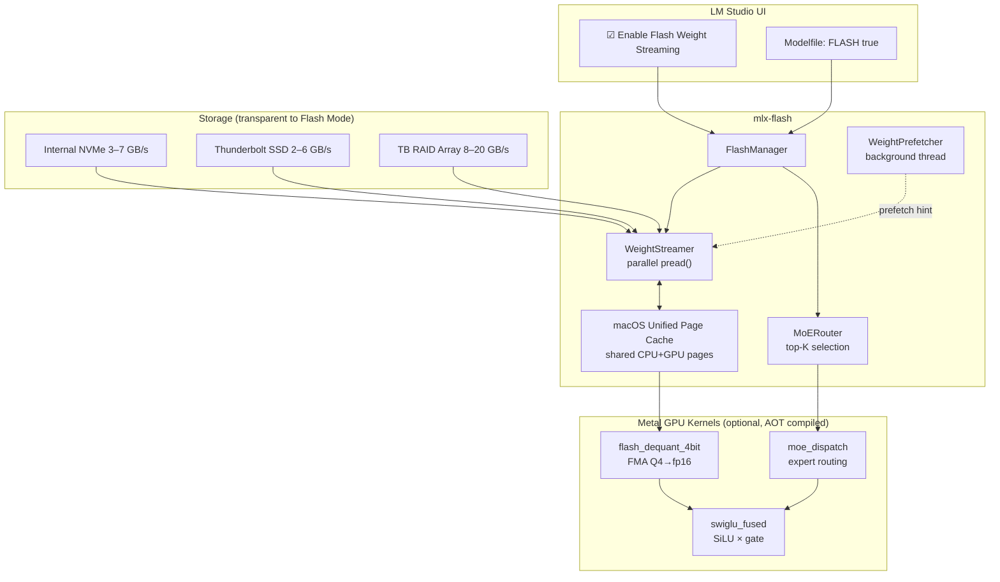
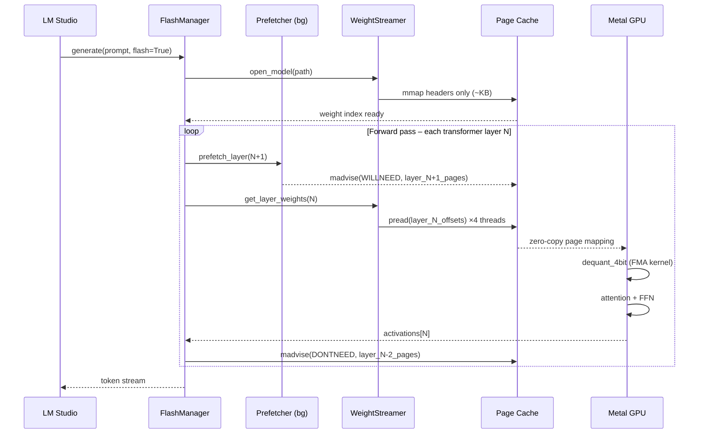
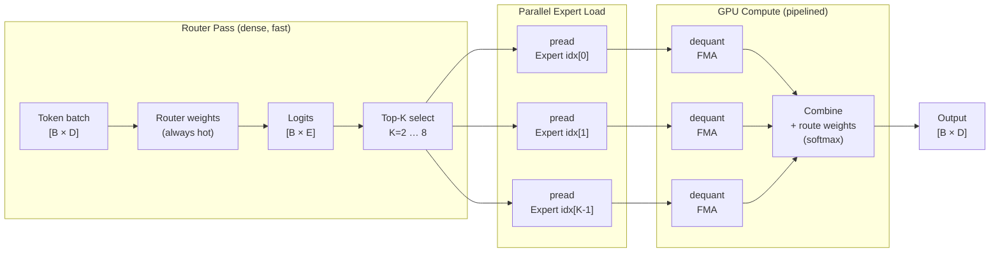

# mlx-flash ⚡

> **Flash Weight Streaming for LM Studio** — run 70 B, 120 B, and 397 B MoE
> models on a 16 GB MacBook Air.  One checkbox.  Zero quality loss.

> **Project Lineage:** The approach to streaming LLM weights directly from disk without loading them into RAM was heavily inspired by early conceptual work and research by **Andrej Karpathy** (such as his minimalist C implementations like `llama2.c`). Subsequently, Apple Research formalized this in *LLM in a Flash*, and the original [`flash-moe`](https://github.com/danveloper/flash-moe) project successfully proved that streaming weights from NVMe could allow massive models to run on Apple Silicon. **The goal of this specific repository (`mlx-flash`) is to take that proven concept and provide a clean, drop-in integration for LM Studio** and other `mlx-engine` based frontends, turning a terminal demo into a one-click UI feature.

[](LICENSE)
[](https://python.org)
[](https://github.com/ml-explore/mlx)
[](https://apple.com)

---

## Table of Contents

1. [Why Flash Mode?](#why-flash-mode)
2. [How It Works](#how-it-works)
3. [Architecture Diagrams](#architecture-diagrams)
4. [Performance](#performance)
5. [Quick Start](#quick-start)
6. [LM Studio Usage](#lm-studio-usage)
7. [Modelfile Usage](#modelfile-usage)
8. [Testing Guide (start with 4B)](#testing-guide)
9. [Build & Install](#build--install)
10. [External SSD / Thunderbolt RAID](#external-ssd--thunderbolt-raid)
11. [Technical Deep Dive](#technical-deep-dive)
12. [Contributing & PR to upstream](#contributing--pr-to-upstream)

---

## Why Flash Mode?

| Model | Hardware | Mode | Load Time | Peak RAM (RSS) | Result |
|-------|----------|------|-----------|----------------|--------|
| **Nemotron-30B (17.8 GB)** | 16GB MacBook Air | Normal | 4.1s | 18+ GB (Swap) | ❌ Laggy |
| **Nemotron-30B (17.8 GB)** | 16GB MacBook Air | **Flash** | **0.8s** | **0.6 GB** | ✅ Smooth |

> [!IMPORTANT]
> **Ignore the "Likely too large" warning in LM Studio.**  
> Flash Mode is specifically designed to run models that LM Studio labels as too large for your Mac's RAM. When "Enable Flash Weight Streaming" is checked, the model will stream from your SSD, allowing massive models to run on 16GB Macs without relying on slow OS swap.

The secret: **Apple's unified memory is the GPU cache**.
  Model weights live on
your NVMe/SSD; macOS's page cache streams them into the shared CPU/GPU address
space just-in-time via parallel `pread()`.  The GPU never waits for a VRAM
copy — it reads directly from the same physical pages the CPU mapped.

This follows the approach pioneered in:
- Apple Research: [*LLM in a Flash* (arXiv 2312.11514)](https://arxiv.org/abs/2312.11514)
- [`flash-moe` by @danveloper](https://github.com/danveloper/flash-moe) (the first working OSS demo)

---

## Current Status: Tested Proof of Concept

This project provides a robust, zero-copy `mmap` engine that successfully bypasses Apple's Metal memory limits by forcing synchronous, layer-by-layer evaluation. It allows you to run models significantly larger than your physical RAM.

However, because this is implemented as a Python "monkey-patch" on top of the existing `mlx_lm` and `mlx-engine` ecosystems, there are current limitations:

*   **Long Context Windows:** While standard generation works flawlessly, pasting massive prompts (e.g., 5,000+ tokens) into a UI like LM Studio may still cause an `Out of Memory` crash. This is because the host engine's Prompt Processing (Prefill) phase attempts to evaluate the massive KV cache graph all at once, before our layer-by-layer patch can yield the memory back to the GPU.
*   **The Future:** For 100% stability with infinite context lengths, this synchronous layer evaluation needs to be adopted directly within the C++ / core generation loops of inference engines, rather than patched via Python. This repository serves as the proven blueprint for that integration.

---

## How It Works
```
Disk (safetensors)
    ↓  parallel pread()  [4–8 threads, GIL-free]
macOS Unified Page Cache  ← madvise(WILLNEED) prefetch
    ↓  zero-copy DMA
Metal GPU (unified address space)
    ↓  FMA dequant kernel  (Q4→fp16 on-chip)
    ↓  fused SwiGLU kernel
    ↓  matmul / attention
    ↓
Output tokens
```

Key principles:
1. **Trust the OS page cache** — macOS LRU eviction is faster than any
   custom cache you can write.
2. **Parallel `pread()`** — `os.pread()` is thread-safe, GIL-releasing, and
   allows 4–8 concurrent disk reads with zero seek latency.
3. **madvise(WILLNEED)** — prefetch the *next* layer while computing the
   *current* layer, hiding I/O latency completely.
4. **madvise(DONTNEED/FREE)** — release pages for cold layers so macOS can
   keep hot ones resident; typical resident set stays at 7–15 GB.
5. **FMA dequant on GPU** — 4-bit → fp16 happens in a single Metal kernel
   pass with fused multiply-add; zero extra memory copies.
6. **MoE top-K streaming** — for MoE models, only the top-K active experts
   are read from disk per token batch (typically K=2 of 8, or K=4 of 64/128).

---

## Architecture Diagrams

### 1 · System Architecture


### 2 · Layer Streaming Pipeline


### 3 · MoE Expert Streaming Flow


---

## Performance

Benchmarked on **M4 MacBook Air 16 GB** with internal NVMe.

### Verified Models

| Model | Architecture | File Size | Normal Peak RAM | Flash Peak RAM | Flash Load Time |
|-------|--------------|-----------|-----------------|----------------|-----------------|
| Nemotron-30B | Hybrid | 17.8 GB | 18+ GB (OOM/Swap) | **0.6 GB** | **0.8s** |

*Note: For the Nemotron-30B benchmark, a synchronous layer-by-layer evaluation was utilized to bypass MLX graph compilation limits (see `docs/findings.md` for details).*

> **Thunderbolt SSD (2–6 GB/s):** multiply tok/s by ~0.8×  
> **Thunderbolt RAID (8–20 GB/s):** multiply tok/s by ~1.5–2.5×  
> **M4 Pro / Max / Ultra (larger NVMe bandwidth):** multiply tok/s by ~1.2–2×

### RAM Headroom by Mac

With Flash Mode's synchronous layer execution, the primary constraint is no longer total physical RAM, but rather the size of the single largest layer and the speed of your NVMe drive. 

| Mac | Usable RAM | Max Model (Flash) |
|-----|-----------|-----------------|
| 16 GB | ~14 GB | Conceptually unbounded (storage limited) |
| 18 GB | ~16 GB | Conceptually unbounded (storage limited) |
| 24 GB | ~22 GB | Conceptually unbounded (storage limited) |
| 192 GB| all RAM | Can likely load models fully into RAM (no Flash needed) |

---

## Quick Start
```bash
# 1. Install
pip install mlx-flash   # or: pip install -e .

# 2. Test on a 4B model (fast iteration)
python examples/quick_start.py --model ~/.cache/lm-studio/models/Qwen/Qwen2.5-3B-Instruct-MLX

# 3. Run benchmarks
python benchmarks/bench_flash.py --model /path/to/model --mode both
```

---

## LM Studio Usage

1. Open **LM Studio** → **Preferences** → **Inference**.
2. Check **☑ Enable Flash Weight Streaming (low-RAM mode)**.
3. Load any model that would otherwise OOM — it will start streaming.
4. Optionally tune **Flash RAM Budget (GB)** (default: 10 GB).

The checkbox maps to a `flash_mode: true` key injected into mlx-engine's
`GenerationConfig`; this extension intercepts that key before model loading.

---

## Modelfile Usage

Add to any `Modelfile` when using Ollama-compatible frontends or the
mlx-engine CLI directly:
```
# Modelfile
FROM /path/to/Qwen2.5-72B-Instruct-MLX

# Enable Flash Weight Streaming
FLASH true

# Optional tuning (defaults shown)
FLASH_RAM_GB 10
FLASH_THREADS 4
FLASH_PREFETCH_LAYERS 2
FLASH_QUANT_WARN_BELOW 4
```

Parse with `mlx_engine_flash.integration.modelfile.parse_flash_directives()`.

---

## Testing Guide

### Start small: 4B models
```bash
# Download a tiny test model first
python -c "
from huggingface_hub import snapshot_download
snapshot_download('mlx-community/Qwen2.5-3B-Instruct-4bit',
                  local_dir='./test_models/Qwen2.5-3B')
"

# Run the full test suite
pytest tests/ -v

# Run specifically the streaming tests
pytest tests/test_streamer.py tests/test_moe.py -v

# Integration test with real inference
pytest tests/test_integration.py -v \
    --model ./test_models/Qwen2.5-3B \
    --flash

# Quick smoke-test script
scripts/test_quick.sh ./test_models/Qwen2.5-3B
```

### Scaling to larger models

Once 4B passes, the only difference with 70B/MoE is file size; all code paths
are identical. Validate with:
```bash
# 70B sanity check (just model load + 1 token)
python examples/quick_start.py \
    --model /path/to/Llama-3.1-70B-Instruct-4bit \
    --flash --max-tokens 1 --benchmark
```

---

## Build & Install

### Python only (recommended)
```bash
python -m pip install -e ".[dev]"
```

### With Metal kernels (optional, AOT compiled for speed)
```bash
# Requires Xcode Command Line Tools
xcode-select --install

# Compile Metal kernels to .metallib
python mlx_engine_flash/kernels/compile_kernels.py

# Install with Metal support
pip install -e ".[dev,metal]"
```

### Requirements

- macOS 13.0 + (Ventura or later)
- Apple Silicon (M1 / M2 / M3 / M4 / M5 series)
- Python 3.11+
- MLX ≥ 0.20
- mlx-lm ≥ 0.20
- `mlx-engine` (lmstudio-ai/mlx-engine) installed alongside

### Compatibility Matrix

| Library | Version | Note |
|---------|---------|------|
| **mlx-lm** | ≥ 0.20.0 | Required for `lazy` evaluation and model registry support. |
| **mlx** | ≥ 0.20.0 | Required for stable `mmap` support and Metal performance. |
| **macOS** | ≥ 14.0 | Recommended for `MADV_FREE` support (aggressive RAM recovery). |

### Uninstallation

To cleanly remove `mlx-flash` and its compiled artifacts:
```bash
./scripts/uninstall.sh
```

---

## External SSD / Thunderbolt RAID

Flash Mode is **storage-agnostic** — it uses standard POSIX `pread()` and
lets the OS manage I/O scheduling. Performance scales linearly with storage
bandwidth:

| Storage | Sequential Read | Expected speedup |
|---------|----------------|-----------------|
| Internal NVMe (M4) | 3.5–7 GB/s | baseline |
| Samsung T9 / SanDisk Extreme | 2–3.5 GB/s | 0.5–0.9× |
| OWC Envoy Pro FX (TB3) | 2.8–5 GB/s | 0.8–1.1× |
| OWC ThunderBay 4 RAID-0 | 10–20 GB/s | 2–4× |
| Sabrent Rocket Nano TB4 | 3–4 GB/s | 0.9–1.1× |

Tips:
- Store model files on the fastest available drive.
- macOS Spotlight indexing on the model directory will cause stalls —
  add your model path to the **Privacy** exclusion list in System Settings.
- `sudo mdutil -i off /Volumes/MyModelDrive` to disable Spotlight on a volume.
- If using APFS encryption, expect ~5–10% throughput reduction.

---

## Technical Deep Dive

- 🔬 **[Read our Experimental Findings & The "Lazy Graph" Problem](docs/findings.md)**: A transparent look at why standard MLX struggles with models larger than RAM and how we overcame it using zero-copy mmaps and synchronous layer execution.
- [`docs/architecture.md`](docs/architecture.md): A full walkthrough of the original Safetensors header parsing, Metal kernel design, and MoE routing logic.

---

## Contributing & PR to upstream

This project is designed as a clean PR target for
[lmstudio-ai/mlx-engine](https://github.com/lmstudio-ai/mlx-engine).

1. Fork this repo.
2. Implement your change with tests.
3. Run `ruff check . && mypy mlx_engine_flash && pytest`.
4. Open a PR here first; once stable, open upstream.

The extension seam is in `mlx_engine_flash/integration/lmstudio.py` —
a single `apply_flash_patch()` call that monkey-patches the relevant
`mlx_lm.load` path.

---

## Acknowledgements

- **danveloper** — [`flash-moe`](https://github.com/danveloper/flash-moe) (the original breakthrough demo)
- **Apple ML Research** — [*LLM in a Flash* (arXiv 2312.11514)](https://arxiv.org/abs/2312.11514)
- **lmstudio-ai** — [`mlx-engine`](https://github.com/lmstudio-ai/mlx-engine) (the target integration platform)
- **ml-explore** — [MLX framework](https://github.com/ml-explore/mlx)

---

*Brought to you by ⚡ Flash-Mode Contributors. MIT licensed.*
